# Proyecto Curso Automatizacion con patrón de diseño screenplay
## Automatizacion de funcionalidades web, app y servicios


<p align="center">

  <a href="https://serenity-bdd.github.io/theserenitybook/latest/index.html"> 
   
  </a>
  <a href="https://cucumber.io/">
  
  </a>
  <a href="https://www.selenium.dev/"> 
   
  </a>
  <a href="https://gradle.org/"> 
   
  </a> 
</p>
Prueba tecnica de implementación de funcionalidad web

## Proyecto construido con patrón de diseño para automatización screenplay
El patrón de diseño screenplay ha sido mayormente difundido por serenity BDD, aunque el patrón en sí es en gran medida independiente del lenguaje y del marco
### Pilares POO en screenplay
- Encapsulamiento
- Herencia
- Polimorfismo
- Abstracción

### Principios SOLID en screenplay
- S -   Principio de responsabilidad unica
- O -  Principio abierto cerrado
- L  -   Principio sustitución Liskov
- I   -   Principio segregación  de interfaces
- D -  Principio Inversión de dependencias

### Paquetes en screenplay
- Features
- Runners
- Steps definition
- Tasks
- Interaccion
- Questions
- User interface

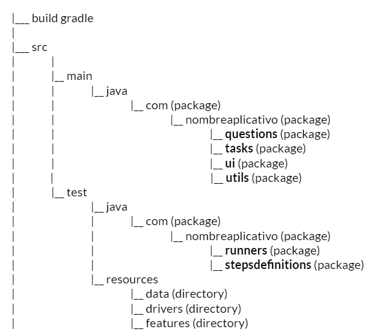

## Configuración de maquina windows
- Tener instalada el jdk de la pagina de oracle, ir a https://www.oracle.com/java/technologies/downloads/#jdk18-windows
- crear la variable de entorno JAVA_HOME y agregar al path
  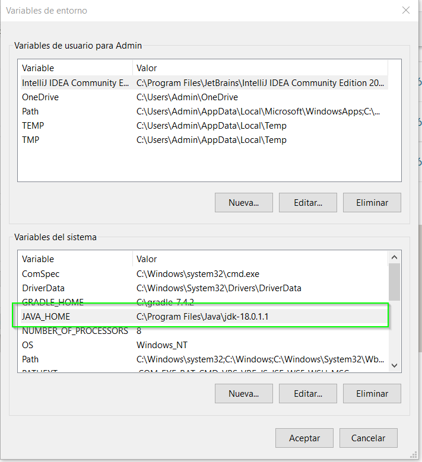
- agregar al path la variable java_home\bin
  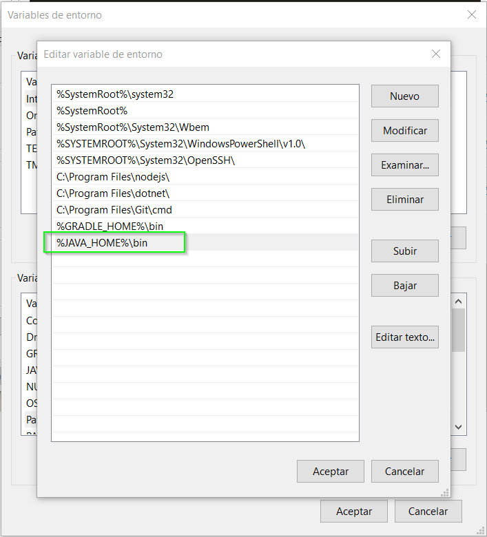
- verificar en consola cmd que este correctamente creada (en caso que le genere error, reiniciar la computadora)
  
- descargar gradle desde la pagina de releases, ir a https://gradle.org/releases/ , descargar la versión completa
  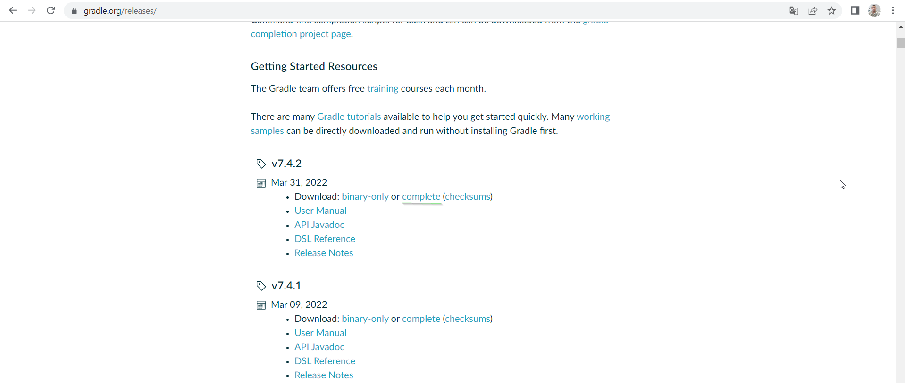


## Descarga del proyecto

- Acceder a la url del proyecto https://gitlab.com/ias-training/automatizacion-demo-screenplay
  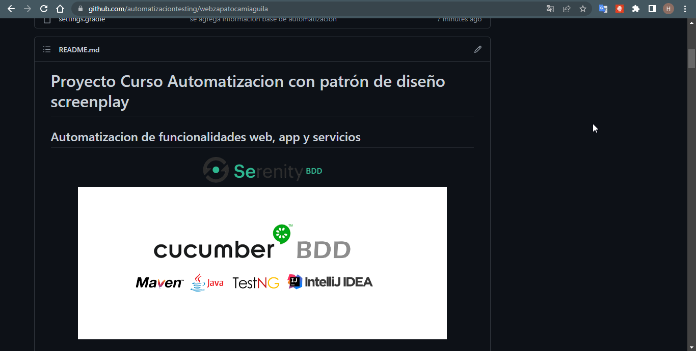
- Seleccionar la opción "Clone" usar en la lista "Clone with https"
- Copiar el link del vinculo :  https://gitlab.com/ias-training/automatizacion-demo-screenplay.git
  - Usar una herramienta para conectar y descargar el proyecto, ejemplo Gitbash, https://git-scm.com/downloads.
    
    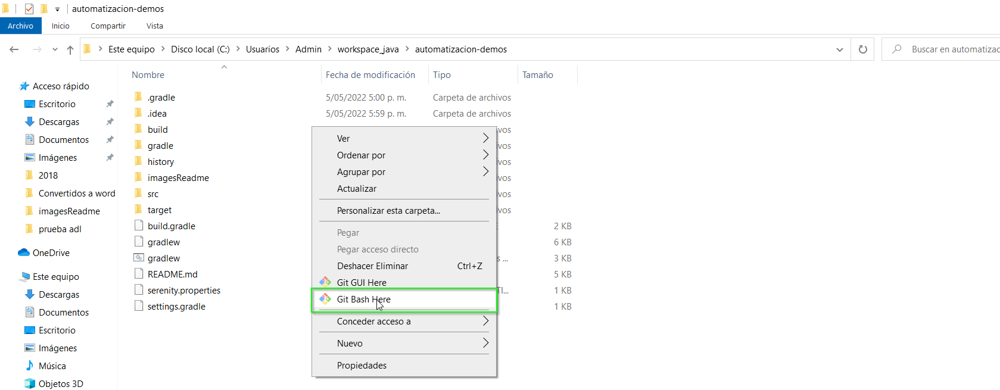
    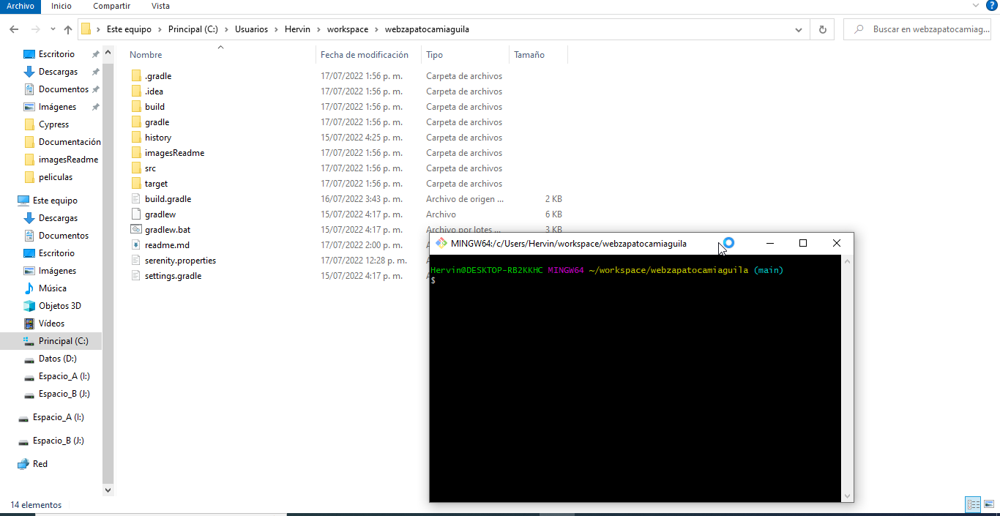

## Reporte de serenity
  El framework de serenity permite generar una vez concluidas las pruebas un reporte que resume los resultados tanto de pasos como del resultado esperado.
  Para consultar este reporte ir a raizProyecto\target\site\serenity

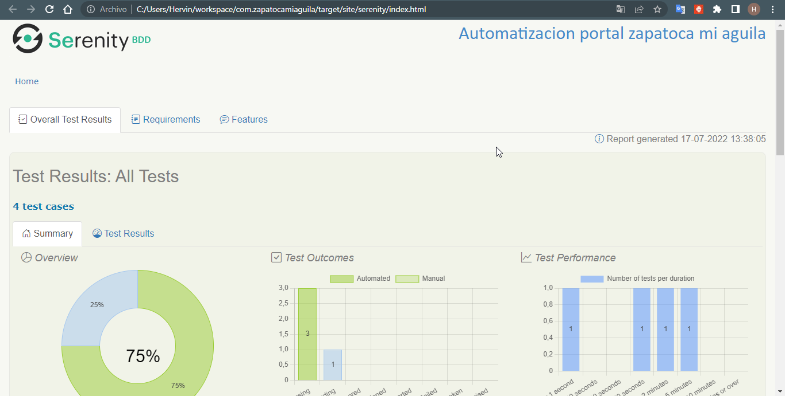
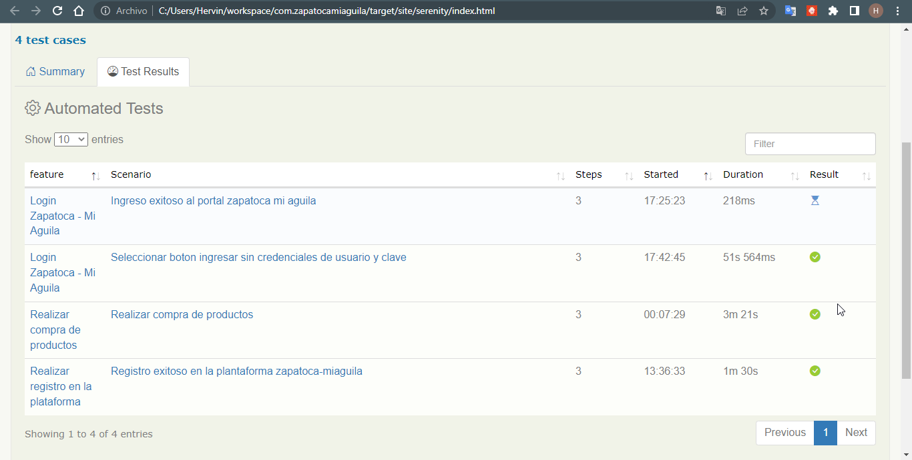


## Repositorio Documental

| Ruta  | 
| :------------------------------------------ |
||


## Reporte de Serenity resumido


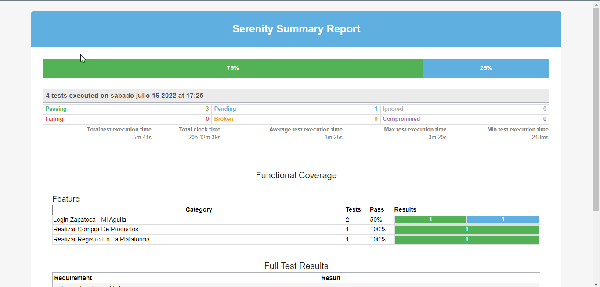
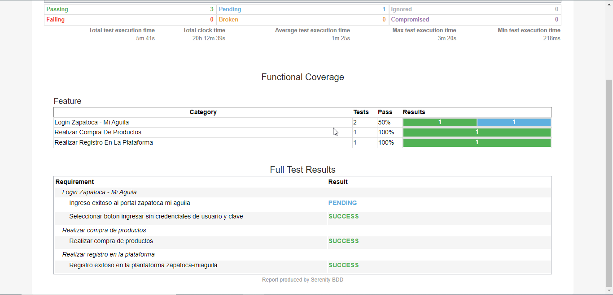

Git global setup
```sh
git config --global user.name "Hervin Camargo Carlier"
git config --global user.email "hervin.camargo@ias.com.co"
```

Comando Push en proyecto existente
```sh
cd ias
git init
git remote add origin https://gitlab.com/ias-training/automatizacion-demo-screenplay.git
git add .
git commit -m "Initial commit"
git push -u origin main
```
Como ejecutar el proyecto

| Ruta                                          | Acción                                                                                                                                                                                          |
|-----------------------------------------------|-------------------------------------------------------------------------------------------------------------------------------------------------------------------------------------------------|
| \src\test\java\com\automatizacion\runners | ejecutar el runner de la funcionalidad, dando clic derecho sobre la clase                                                                                                                       |
| Consola cmd en la raíz del proyecto           | ejecutar comando: gradle clean test -Dtags=nombreTag , el nombre del tag se encuentra en el feature anterior a la definición del escenario.                                                     |


# Licencias

MIT
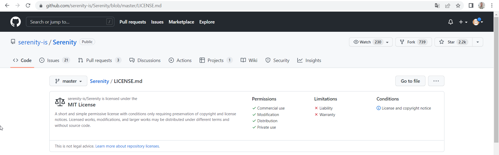
Open-Source

**Free Software!**